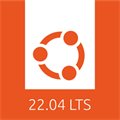

# my development setup
It is a very opinionated setup with a lot of opinions and unsupported claims.
But maybe you find here tools that you are not aware of and would like to explorer... 
If you use a tool that needs to be added to my development setup, please create a PR. 😉 

## jetbrains IDE

JetBrains has beautiful integrated development environments (IDE) that you can use to build nice products. 
At first they might be a bit overwhelming, but after a while you will learn all bells and whistles (just take your time).
The following IDE are great for specific tasks:

| icon               | languages               | download link                 |
| ------------------ | ----------------------- | ----------------------------- |
| ![][logo-intellij] | java                    | [download][download-intellij] |
| ![][logo-pycharm]  | python                  | [download][download-pycharm]  |
| ![][logo-webstorm] | javascript / typescript | [download][download-webstorm] |
| ![][logo-clion]    | c / c++ / rust          | [download][download-clion]    |

The community versions are more basic than the ultimate versions. The ultimate versions unlock also 
simple integration with all kind of frameworks. 

How to choose the right IDE for your job. That's actually very simple. You take the project and if it holds for instance mainly
java files, then you would opt for Intellij. If you need also typescript support for a small part in that code base, then 
Intellij can be extended by plugins to unlock also support for typescript. It is up to your preference how you want to use the
Jetbrains IDE, the rationale is that the IDE will adapt to you as a developer (see also [Fleet](https://www.jetbrains.com/fleet/) 
it shows how Jetbrains see their role to support the developer). 

## visual studio code

This tool from Microsoft is the swiss army knife for a developer. It can be used as a text editor, but can also be scaled up to a full fletched IDE. It just depends on your preference. 
It is also free for download, you can download it. 

[installation instructions](https://apps.microsoft.com/store/detail/XP9KHM4BK9FZ7Q) | [documentation](https://code.visualstudio.com/docs) | [sources](https://github.com/microsoft/vscode)

## java

When you are building software with the programming language Java. There are a lot of options to choose from, see for example the list on java 17: https://foojay.io/almanac/java-17/ 

I would recommend to use Eclipse Temurin.

## windows terminal

While working as a developer you often would like to have access to the commandline. Microsoft has a great terminal to work with. Windows 11 has windows terminal installed by default. But for windows 10 you need to install it yourself. 

[installation instructions](https://www.microsoft.com/store/productId/9N0DX20HK701) | [documentation](https://learn.microsoft.com/en-us/windows/terminal/) | [sources](https://github.com/microsoft/terminal)

## wsl - windows subsystem for linux

If you write software for linux on a windows pc, then you might want to have access to linux as well. On windows there is a tool called wsl2 with great integration into the windows operating system. 

[installation instructions](https://learn.microsoft.com/en-us/windows/wsl/install) | [documentation](https://learn.microsoft.com/en-us/windows/wsl/)

## linux distro

For years I've used ubuntu as a desktop operating system to do all of my work. That originates from the time when windows blue
screens were very frequent and I decided to use something more stable. I started with linux from scratch, even tried mandrake etc.
Used also Fedora for a while. But when ubuntu decided to focus on a stable desktop I switched after a lot of distro hopping to 
make ubuntu my default desktop. 
When I need to choose between distros for server use, I think that RedHat Linux and Ubuntu Server are the best choices to make. 
But my personal favorite would be Ubuntu Server at the moment. 

Canonical and Microsoft are working together to improve the usability linux on windows, which resulted in wsl2.
So I think it might be also a good bet for the longer run. 

To install ubuntu in wsl, please go to windows store and search for ubuntu. 

## version control - git

Git is the first choice for me when selecting a version control system.

Make sure that autocrlf is switched to false. Otherwise bash scripts or linux configuration can break, see also [this article](https://www.aleksandrhovhannisyan.com/blog/crlf-vs-lf-normalizing-line-endings-in-git/). Copy-paste
the following snippet to your terminal to make it happen. 

```shell
git config --global core.autocrlf false
```

When you want to list all configuration:

```shell
git config --global -l
```

[installation instructions](https://git-scm.com/downloads) | [documentation](https://git-scm.com/doc) | [sources](https://github.com/git/git) 

## containers and images


For containers and the use of images [Docker](https://www.docker.com/) is currently the default. Please be aware that when 
using [Docker desktop](https://www.docker.com/products/docker-desktop/alternatives/) that for personal usage it is free 
of charge, but for large corporations Docker has a software license in place. 

There is a difference between [docker engine](https://docs.docker.com/engine/) (which is free to use by everyone) and [docker desktop](https://docs.docker.com/desktop/). Docker desktop makes it possible to install a kubernetes cluster on your dev machine with one press of a button.  

After a few freezes of the docker desktop ui and initialization issues after a reboot, I decided to get rid of docker desktop and go for docker engine. The reasons for me are the following:
1. Docker desktop doesn't add a lot of value.
1. Windows 11 supports now systemd on wsl2, so there is one reason less to have Docker desktop installed.
1. Potential licencing issues: 

My advice would be to install WSL and use docker from WSL (follow [these instructions](https://nickjanetakis.com/blog/install-docker-in-wsl-2-without-docker-desktop)), the reason is that docker is more or less a standard tool nowadays (although it is not my favorite from a security perspective).

After install instruction: 
```powershell
# run the command below to open the powershell startup script
notepad $profile   # you can also opt for any other text editor, like vim or code for example.
```
Copy paste the code below in the editor, save and close it.
```powershell
function docker()
{
	$allArgs = $PsBoundParameters.Values + $args
	& wsl docker $allArgs
}
```

After this setup, you should be able to invoke the following from powershell:
```powershell
docker run -it hello-world
```

**Note** Mounting volumes in powershell is not likely to work. 


[Podman](https://podman.io/) serves as an alternative for docker it is deamonless and it doesn't need to run as root, which
makes it a more secure alternative than docker. 

## github vs gitlab
I use Github for publishing my code in public repos and to collaborate on opensource projects. 
For my personal projects I use Gitlab, because I'm able to run the builds on my personal laptop and it is easy to setup. 


## my prompt - powershell

The default prompt for powershell is a little bit basic. You might want to know on which branch you are when you are in a folder
which is tracked by git. In this case I would recommend to install posh.

[installation instructions](https://ohmyposh.dev/docs/installation/windows) | [documentation](https://ohmyposh.dev/docs) | [sources](https://github.com/jandedobbeleer/oh-my-posh) 

## my prompt - bash

The default prompt for bash is a little bit basic. If you want more information on your prompt, please use oh-my-bash. Another approach is to use oh-my-posh (like as with powershell), you can make your prompt the same as for powershell.

[installation instructions](https://ohmybash.nntoan.com/) | [documentation](https://ohmybash.nntoan.com/) | [sources](https://github.com/ohmybash/oh-my-bash) 


<!--
[installation instructions]() | [documentation]() | [sources]() 
-->


[logo-intellij]: ./img/IntelliJ_IDEA_icon.svg
[logo-pycharm]: ./img/PyCharm_icon.svg
[logo-webstorm]: ./img/WebStorm_icon.svg
[logo-clion]: ./img/CLion_icon.svg

[download-intellij]: https://www.jetbrains.com/idea/download/
[download-pycharm]: https://www.jetbrains.com/pycharm/download/
[download-webstorm]: https://www.jetbrains.com/webstorm/download/
[download-clion]: https://www.jetbrains.com/clion/download/
